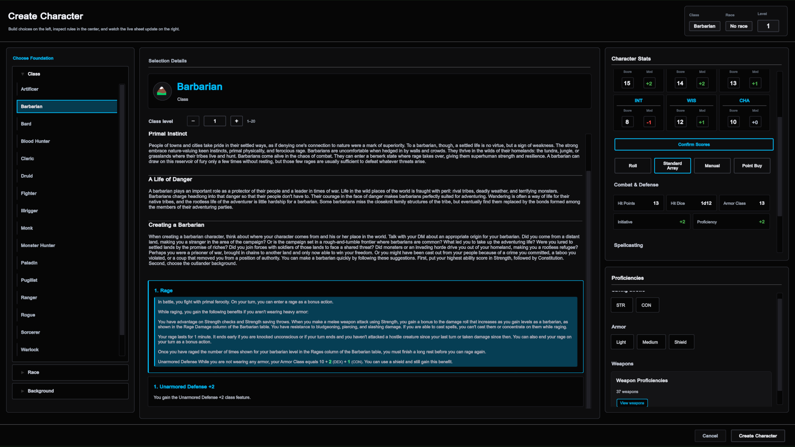
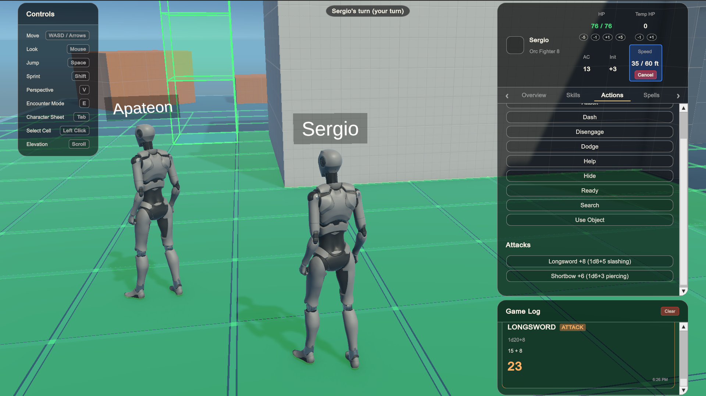
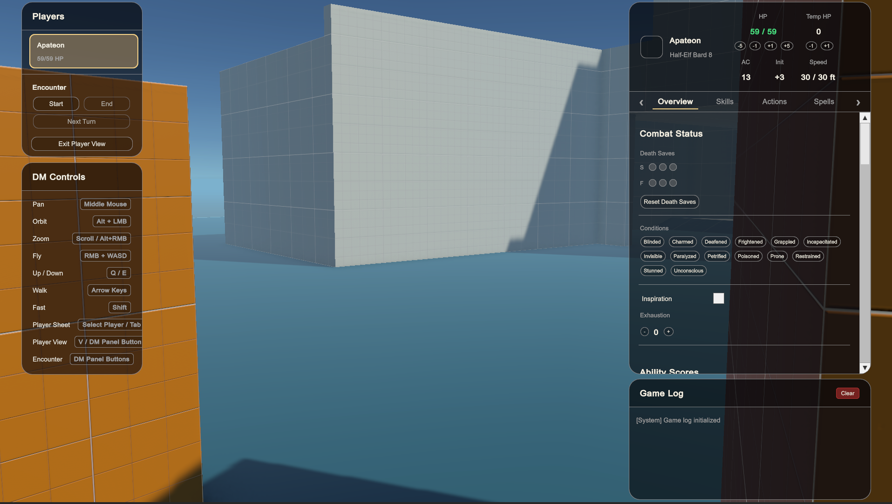

# VTT

VTT is a Unity-based **virtual tabletop** for running online tabletop RPG sessions. It is being built to reduce the bookkeeping and prep work that often slows down games like Dungeons & Dragons while preserving the imagination, improvisation, and shared storytelling that make tabletop games work.

The encounter space is being built around a **3D tabletop** that is intended to make positioning, elevation, line of sight, darkness, cover, traps, and spatial relationships easier to understand than on a flat battle map. At the same time, the project still uses 2D where tabletop games naturally use 2D: UI, character sheets, tactical overlays, maps, handouts, reference art, setting images, and mood pieces.

The goal is not to turn tabletop play into a fully scripted video game. Instead, VTT aims to function like an interactive tabletop workspace: fast for a DM to shape, clear enough for players to understand, and structured enough to automate the mechanical details that are hard to track by hand.

Players should be able to feel more present in the scene by seeing through their character’s perspective, with third-person, top-down, and tactical camera views planned for when they need to make strategic decisions. The DM should be able to run the session, adjust the environment, manage combat, and support player interaction without constantly switching between maps, character sheets, notes, audio tools, and separate map-making software.

## Project vision

Tabletop RPGs ask the DM and players to track a large number of small but important details:

* Where every character is standing
* What each character can see
* Whether a creature has line of sight
* Whether a target is in range
* How elevation affects movement and visibility
* Whether an area is dark, obscured, hidden, trapped, or difficult to move through
* Which actions, reactions, and resources have already been used
* How spells, hazards, terrain, and environmental effects change the encounter

These details are often handled mentally, through theater of the mind, or with a flat 2D battle map. That works well for many situations, but it can become difficult when a scene involves elevation, darkness, cover, vertical spaces, hidden threats, traps, or complicated positioning.

VTT is being built to make those mechanical details more implicit and automatic. The DM should be able to focus more on running the world, describing the scene, and responding to player choices, while the tool handles more of the repeated tracking: movement, turns, targeting, grid positioning, character state, visibility, and combat flow.

The intended experience sits between a traditional tabletop and a game-like interface. It should provide enough structure to make play smoother, but not so much that every interaction has to be scripted, animated, or built like a finished video game level.

## Why a 3D tabletop with 2D support?

VTT is built around a 3D encounter space, but it is not trying to replace every part of tabletop play with 3D assets.

A tabletop session uses many kinds of information. Some of that information benefits from 3D: character positioning, elevation, cover, darkness, line of sight, vertical movement, traps, terrain, and spatial puzzles. Other parts are better handled as 2D content: character sheets, UI panels, world maps, handouts, location art, NPC portraits, clues, mood images, and reference material.

The goal is to use each format where it is strongest.

The 3D space is for the playable tabletop: where characters stand, move, fight, explore, and interact with the environment. The 2D layer supports the session around that space, giving the DM ways to share images, maps, notes, rules information, and atmosphere without leaving the tool.

Top-down play is part of this vision as a camera perspective over the 3D tabletop rather than as a separate 2D encounter system. Today, players can switch between first-person and third-person views; top-down and tactical cameras are planned for later.

The project should make the table easier to run without forcing the DM to prepare polished 3D assets or build every scene like a finished video game level.

## DM-focused design

One of the main goals of VTT is to reduce DM overhead.

In many online games, the DM has to search for maps online, buy or download asset packs, use separate map-making tools, import images, line up grids, manage tokens, keep notes somewhere else, play music from another app, and still manually track the mechanical state of the game.

VTT is intended to bring more of that workflow into one place.

The long-term goal is for a DM to be able to quickly enter a scene, block out a playable space, adjust the layout, place hazards or points of interest, and start running the session without needing a finished battle map or a separate art pipeline. The scene does not need to be visually perfect. It should be fast to shape, easy to read, and mechanically useful during play.

Planned DM-facing tools include:

* Fast map prototyping
* Whitebox-style 3D encounter building
* Encounter setup tools
* Traps and hazards
* Visibility and obscurity tools
* Light and darkness rules
* Notes and journals
* Image sharing for settings, mood, NPCs, locations, and handouts
* Sound effects and mood music
* Player-adjustable audio controls
* Session management tools
* Character sheet review and editing

The purpose is to offload the repetitive parts of running a session without taking control away from the DM.

## Player experience

Players should be able to understand the world from both an immersive and tactical perspective.

VTT currently supports first-person and third-person-style player perspectives. The first-person view is meant to help players see from their character’s point of view: what is in front of them, what they can see, how close threats feel, and how the scene reads from inside the space.

The third-person view gives players better spatial awareness around their character. Top-down and tactical cameras are planned for combat, when players need to think about movement, positioning, range, and strategy.

The long-term goal is to let players move between views depending on the situation:

* First-person for exploration, atmosphere, and character perspective
* Third-person for movement and nearby spatial awareness
* Top-down or tactical camera views for combat strategy
* Character sheet views for build choices, resources, and rules information
* 2D handouts, maps, images, and references when the DM wants to show information outside the encounter space

The tool should clarify the world, not replace the player’s imagination. A player should feel more grounded in their character’s position without losing the flexibility of a tabletop RPG.

## Current features

### Character creation

VTT includes a working character creation flow inspired by D&D 5e-style rules.

Current character creation features include:

* Ability score generation using roll, standard array, manual entry, or point buy
* 4d6 drop-lowest rolling
* Drag-and-drop assignment of rolled scores
* Class, race, and background selection
* Load and select existing characters from JSON files (saving newly created characters to disk is still in progress)
* Real-time stat updates while building a character
* Rules-backed calculations for character sheet values

The goal is for character creation to feel closer to building a character in a game interface while still producing a tabletop character sheet that belongs in an RPG session.



### Multiplayer sessions

Players can host or join sessions from the main menu.

Current multiplayer features include:

* Host and join flow
* Multiplayer player spawning
* Networked character identity
* Replicated player and combat state
* Session flow from menu to gameplay scene
* Host/server validation for important gameplay actions

The intended long-term workflow is simple: anyone with the executable can host a session as the DM or join a session as a player.

### Encounter mode

VTT includes a tactical encounter mode for grid-based play.

Current encounter features include:

* Grid-based movement
* Reachable-cell highlighting
* Pathfinding
* Diagonal movement support
* Server-validated movement
* Dash support
* Initiative rolling
* Turn-order tracking
* Active encounter state
* Current-turn ownership

Encounter mode is meant to handle the mechanical side of turn-based play while still leaving the DM free to narrate, adjudicate edge cases, and shape the encounter.



### Combat

The combat system currently supports a foundational tabletop-style combat loop. In-game player attacks are wired for **unarmed strike** today; broader weapon, ranged, and spell combat is still expanding on top of the shared systems below.

Implemented combat features include:

* Attack resolution (unarmed strike in the current player flow)
* Melee reach validation
* Action economy tracking
* HP and temporary HP
* Death saves
* Conditions
* Exhaustion
* Inspiration
* Target highlighting
* Basic combat feedback, such as damage flash effects
* Character sheet changes routed through gameplay services

The goal is to reduce manual tracking without removing DM control.


### DM tools

Current DM-focused tools include:

* Fly camera for overhead control
* Ability to spectate player perspectives



* Ability to view player character sheets and adjust combat state (HP, conditions, death saves, and related tracking)
* Encounter mode controls for turn-based play

Future DM tools are planned around faster scene creation, better encounter setup, map editing, environmental control, notes, journals, image sharing, music, sound effects, and session management.

### Camera and view options

VTT currently supports both first-person and third-person-style player perspectives.

The first-person perspective helps players understand what their character can see and how the space feels from inside the scene. The third-person perspective gives players better spatial awareness for movement and positioning.

The long-term goal is to support multiple ways of viewing and running a session, including immersive views, tactical camera views, and 2D reference material. The project is not intended to be limited to one camera mode or one style of play.

### In-game UI

The UI is built with Unity UI Toolkit.

Current UI work includes:

* Main menu
* Character creation
* Session hosting and joining
* In-game HUD foundation
* Character sheet views
* Shared styling
* Rules-backed UI values and calculations

## Tech stack

| Area       | Technology                  |
| ---------- | --------------------------- |
| Engine     | Unity 6                     |
| Rendering  | Universal Render Pipeline   |
| UI         | UI Toolkit, UXML, USS       |
| Networking | Netcode for GameObjects     |
| Input      | Unity Input System          |
| Camera     | Cinemachine                 |
| Testing    | Unity Test Framework, NUnit |
| Language   | C#                          |

## Project structure

```text
VTT/
├── README.md
├── docs/
│   └── media/                 # Screenshots and demos for the README
├── Assets/
├── GameData/
│   └── Rulesets/
│       └── DnD5e/             # Classes, races, backgrounds, spells, skills, and rules data
├── Scenes/
│   ├── MainMenu.unity         # Menu, session launch, and character creation
│   └── Playground.unity       # Gameplay, multiplayer, and encounter sandbox
├── Scripts/
│   ├── Actors/                # Player actors and character sheet authority
│   ├── Combat/                # Attacks, action economy, targeting, and combat feedback
│   ├── DmTools/               # DM camera and spectate tools
│   ├── EncounterMode/         # Grid, movement, pathfinding, turn order, and encounter state
│   ├── Networking/            # Multiplayer runtime and session flow
│   └── PlayerData/            # Character sheets, ruleset adapters, and persistence
├── UI/
│   ├── MainMenu/              # Menu and character creation UI
│   ├── InGame/                # In-session UI
│   └── Scripts/
│       └── Core/              # Shared UI and scene-loading code
└── Tests/
    └── EditMode/              # Unit tests for rules, combat, grid, networking, and encounter logic
```

Root-level development notes are tracked in:

* `CONTEXT.md` — current project context and implementation notes
* `DECISIONS.md` — architecture and product decisions
* `TASKS.md` — active work and remaining tasks

## Code direction

The project is written with maintainability in mind. Gameplay rules, character data, combat logic, movement, networking boundaries, and UI flow are kept separated where practical so individual systems are easier to test, extend, and replace.

The current implementation includes a D&D 5e-style rules layer, but the long-term goal is to avoid locking the entire project to one system. Rules data and calculations are separated from presentation code where possible so additional systems can be supported later.

Important gameplay actions, such as combat changes and encounter movement, are validated by the host/server instead of being trusted directly from clients.

## Getting started

### Requirements

* Unity 6 or a compatible Unity 6 editor version
* Git
* Unity packages restored through the Unity Package Manager

### Opening the project

1. Clone the repository.
2. Open the project folder in Unity Hub.
3. Let Unity import assets and restore packages.
4. Open `Assets/Scenes/MainMenu.unity`.
5. Press **Play** to test the main menu and character creation flow.
6. Use **Host** to start a session or **Join** to connect from another editor/player instance.

### Running tests

Open Unity’s Test Runner:

```text
Window → General → Test Runner
```

Select **Edit Mode** and run the test suite.

Current tests cover areas such as:

* Character sheet rules
* Combat resolution
* Grid movement
* Encounter state
* Networking bindings
* Ruleset calculations

## Current status

VTT is under active development.

Working systems include character creation, session hosting and joining, multiplayer player spawning, tactical grid movement, encounter turns, foundational combat logic (unarmed strike), character sheet updates, first-person and third-person player perspectives, and several DM tools.

Current development is focused on improving the in-game UI, expanding character and rules support, polishing combat flow, and building toward more DM-facing tools for 3D encounter spaces, visibility, traps, journals, maps, handouts, media, audio, and session management.
